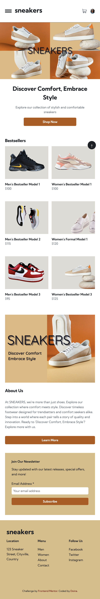

# Frontend Mentor - E-commerce product page solution

This is a solution to the [E-commerce product page challenge on Frontend Mentor](https://www.frontendmentor.io/challenges/ecommerce-product-page-UPsZ9MJp6). Frontend Mentor challenges help you improve your coding skills by building realistic projects.

## Table of contents

- [Frontend Mentor - E-commerce product page solution](#frontend-mentor---e-commerce-product-page-solution)
  - [Table of contents](#table-of-contents)
  - [Overview](#overview)
    - [The challenge](#the-challenge)
  - [Screenshots](#screenshots)
    - [Home Page](#home-page)
    - [Women’s Product Page](#womens-product-page)
    - [Product Details Page](#product-details-page)
    - [Lightbox Gallery](#lightbox-gallery)
    - [Cart Functionality](#cart-functionality)
    - [About Page](#about-page)
    - [Contact Page](#contact-page)
    - [Links](#links)
  - [My process](#my-process)
    - [Built with](#built-with)
    - [What I learned](#what-i-learned)
    - [Continued development](#continued-development)
    - [Useful resources](#useful-resources)
  - [Author](#author)

## Overview

### The challenge

Users should be able to:

- View the optimal layout for the site depending on their device's screen size
- See hover states for all interactive elements on the page
- Open a lightbox gallery by clicking on the thumbnail images
- Switch the large product image using a slider
- Add items to the cart
- View the cart and remove items from it

Extended Tasks:
In addition to the initial project requirements, I have completed the following extended tasks:

- Created the Home, Men, Women, About, and Contact pages.
- On the Men and Women pages, added a sorting feature for the models.
- Added another color to the buttons, considering the rotation aspect.
- Created pages for each model on the Men and Women pages.
- Added the Back to Top feature.

## Screenshots

### Home Page

<table>
  <tr>
    <td>
      <strong>Desktop View:</strong> 
       
      <em>The main landing page on desktop, showcasing navigation and featured products.</em>
    </td>
    <td>
      <strong>Mobile View:</strong> 
       
      <em>The main landing page on mobile, demonstrating responsive design.</em>
    </td>
  </tr>
</table>

### Women’s Product Page

<table>
  <tr>
    <td>
      <strong>Desktop View:</strong> 
       
      <em>The Women’s product page with sorting feature on desktop.</em>
    </td>
    <td>
      <strong>Mobile View:</strong> 
       
      <em>The Women’s product page with sorting feature on mobile.</em>
    </td>
  </tr>
</table>

### Product Details Page

<table>
  <tr>
    <td>
      <strong>Desktop View:</strong> 
       
      <em>Detailed view of a product on desktop.</em>
    </td>
    <td>
      <strong>Mobile View:</strong> 
       
      <em>Detailed view of a product on mobile.</em>
    </td>
  </tr>
</table>

### Lightbox Gallery

<table>
  <tr>
    <td>
      <strong>Lightbox Gallery (Desktop):</strong> 
       
      <em>The lightbox gallery opened by clicking on the thumbnail images on desktop.</em>
    </td>
  </tr>
</table>

### Cart Functionality

<table>
  <tr>
    <td>
      <strong>Cart (Desktop):</strong> 
       
      <em>View of the cart showing items added and the option to remove them.</em>
    </td>
  </tr>
</table>

### About Page

<table>
  <tr>
    <td>
      <strong>Desktop View:</strong> 
       
      <em>The About page on desktop, providing company information.</em>
    </td>
  </tr>
</table>

### Contact Page

<table>
  <tr>
    <td>
      <strong>Mobile View:</strong> 
       
      <em>Focused view of the contact form on the Contact page.</em>
    </td>
  </tr>
</table>

### Links

- Solution URL: [Add solution URL here](https://your-solution-url.com)
- Live Site URL: [live site URL here](https://ecommerce-product-page-ten-chi.vercel.app/)

## My process

### Built with

### What I learned

### Continued development

### Useful resources

## Author

- Frontend Mentor - [@Doileo](https://www.frontendmentor.io/profile/Doileo)
- LinkedIn - [@Doina](https://www.linkedin.com/in/doinaleovchindeveloper/)
