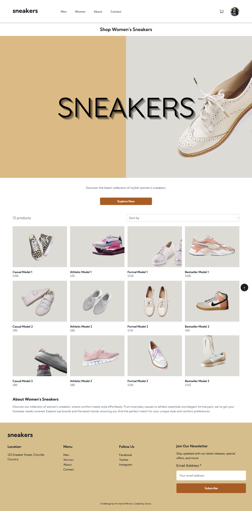
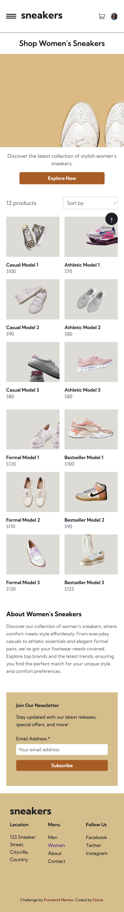
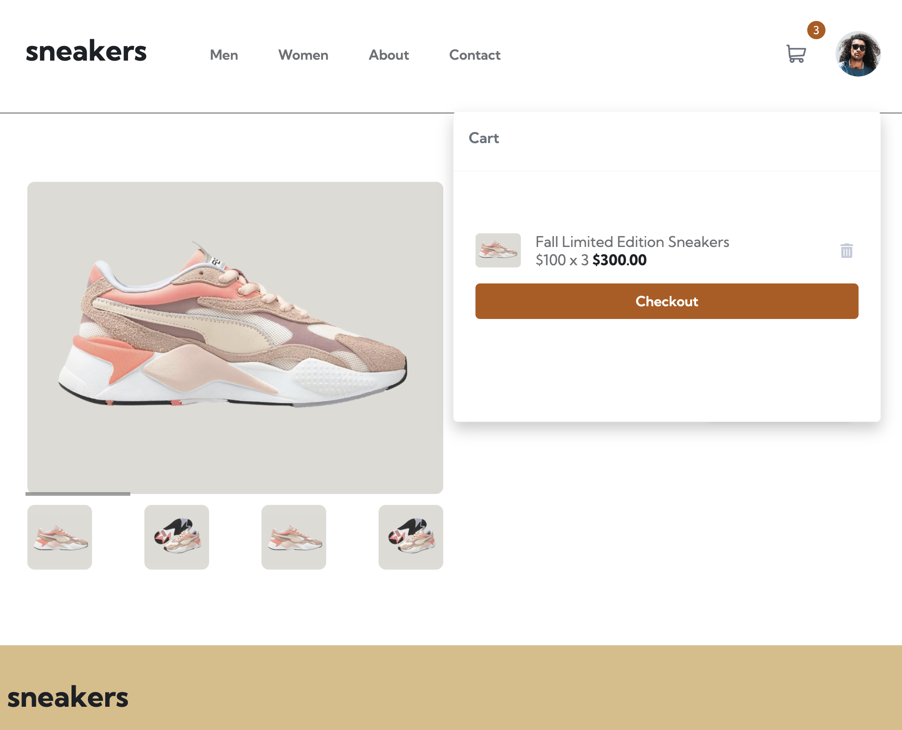

# Frontend Mentor - E-commerce product page solution

This is a solution to the [E-commerce product page challenge on Frontend Mentor](https://www.frontendmentor.io/challenges/ecommerce-product-page-UPsZ9MJp6). Frontend Mentor challenges help you improve your coding skills by building realistic projects.

## Table of contents

- [Frontend Mentor - E-commerce product page solution](#frontend-mentor---e-commerce-product-page-solution)
  - [Table of contents](#table-of-contents)
  - [Overview](#overview)
    - [The challenge](#the-challenge)
  - [Screenshots](#screenshots)
    - [Home Page](#home-page)
    - [Women’s Product Page](#womens-product-page)
    - [Product Details Page](#product-details-page)
    - [Lightbox Gallery](#lightbox-gallery)
    - [Cart Functionality](#cart-functionality)
    - [About Page](#about-page)
    - [Contact Page](#contact-page)
    - [Links](#links)
  - [My process](#my-process)
    - [Built with](#built-with)
    - [What I learned](#what-i-learned)
    - [Continued development](#continued-development)
    - [Useful resources](#useful-resources)
  - [Installation Instructions](#installation-instructions)
  - [Author](#author)

## Overview

### The challenge

Users should be able to:

- View the optimal layout for the site depending on their device's screen size
- See hover states for all interactive elements on the page
- Open a lightbox gallery by clicking on the thumbnail images
- Switch the large product image using a slider
- Add items to the cart
- View the cart and remove items from it

Extended Tasks:
In addition to the initial project requirements, I have completed the following extended tasks:

- Created the Home, Men, Women, About, and Contact pages.
- On the Men and Women pages, added a sorting feature for the models.
- Added another color to the buttons, considering the rotation aspect.
- Created pages for each model on the Men and Women pages.
- Added the Back to Top feature.
- On the Home page, added an interactive element through the "Take Our Style Quiz" button.

## Screenshots

### Home Page

<table>
  <tr>
    <td>
      <strong>Desktop View:</strong><br>
      <br>
      <em>The main landing page on desktop, showcasing navigation and featured products.</em>
    </td>
    <td>
      <strong>Mobile View:</strong><br>
      <br>
      <em>The main landing page on mobile, demonstrating responsive design.</em>
    </td>
  </tr>
</table>

### Women’s Product Page

<table>
  <tr>
    <td>
      <strong>Desktop View:</strong><br>
      <br>
      <em>The Women’s product page with sorting feature on desktop.</em>
    </td>
    <td>
      <strong>Mobile View:</strong><br>
      <br>
      <em>The Women’s product page with sorting feature on mobile.</em>
    </td>
  </tr>
</table>

### Product Details Page

<table>
  <tr>
    <td>
      <strong>Desktop View:</strong><br>
      <br>
      <em>Detailed view of a product on desktop.</em>
    </td>
    <td>
      <strong>Mobile View:</strong><br>
      <br>
      <em>Detailed view of a product on mobile.</em>
    </td>
  </tr>
</table>

### Lightbox Gallery

<table>
  <tr>
    <td>
      <strong>Lightbox Gallery (Desktop):</strong><br>
      <br>
      <em>The lightbox gallery opened by clicking on the thumbnail images on desktop.</em>
    </td>
  </tr>
</table>

### Cart Functionality

<table>
  <tr>
    <td>
      <strong>Cart (Desktop):</strong><br>
      <br>
      <em>View of the cart showing items added and the option to remove them.</em>
    </td>
  </tr>
</table>

### About Page

<table>
  <tr>
    <td>
      <strong>Desktop View:</strong><br>
      <br>
      <em>The About page on desktop, providing company information.</em>
    </td>
  </tr>
</table>

### Contact Page

<table>
  <tr>
    <td>
      <strong>Mobile View:</strong><br>
      <br>
      <em>Focused view of the contact form on the Contact page.</em>
    </td>
  </tr>
</table>

### Links

- Solution URL: [solution URL here](https://www.frontendmentor.io/challenges/ecommerce-product-page-UPsZ9MJp6/hub?share=true)
- Live Site URL: [live site URL here](https://ecommerce-product-page-ten-chi.vercel.app/)

## My process

### Built with

- Semantic HTML5 markup
- CSS custom properties
- Flexbox
- CSS Grid
- Mobile-first workflow
- Vanilla JavaScript
- BEM (Block Element Modifier) naming convention for classes
- Lighthouse for performance and accessibility

### What I learned

Through this project, I have developed my ability to:

- Build a lightbox gallery feature that activates when images are clicked.
- Implement a slider to cycle through large product images.
- Enable users to add products to their shopping cart.
- Develop a shopping cart interface that displays selected items and allows for their removal.

Additionally, I tackled some extended tasks:

- Implemented a feature to sort products on the Men and Women pages.
- Developed detailed product pages for individual items on the Men and Women pages.
- Added a "Back to Top" button for improved navigation.

### Continued development

Looking ahead, I am excited to build another e-commerce project using React. In this future project, I plan to:

- Add size options for products, along with a size chart for users to consult.
- Implement a "heart" favorite feature to allow users to save their favorite items.
- Include a slider for product models that lets users preview different models before accessing their details.

I am eager to apply what I've learned and expand on these features to create a more interactive and user-friendly shopping experience.

### Useful resources

- [Lighthouse Documentation](https://developers.google.com/web/tools/lighthouse) - This documentation was crucial for optimizing the performance and accessibility of the site. It guided me through using Lighthouse for auditing and improving various aspects of the project.

- [BEM Methodology](https://getbem.com/introduction/) - This resource helped me learn and implement the BEM (Block Element Modifier) naming convention for my CSS classes. It made my code more readable and maintainable, and I plan to continue using this methodology in future projects.

- [W3Schools - JavaScript Array sort()](https://www.w3schools.com/jsref/jsref_sort.asp) - This resource was extremely helpful for implementing the sorting feature for products on the Men and Women pages. The examples and explanations provided a clear understanding of how to use the `sort()` method effectively.

## Installation Instructions

To set up the E-commerce Product Page on your local machine, follow these steps:

1. Clone the repository:

   ```bash
   git clone https://github.com/yourusername/ecommerce-product-page.git
   ```

2. Navigate to the project directory:
   ```bash
   cd ecommerce-product-page
   ```
3. Open the project in your browser:
   Simply open the `index.html` file in your preferred browser.

## Author

- Frontend Mentor - [@Doileo](https://www.frontendmentor.io/profile/Doileo)
- LinkedIn - [@Doina](https://www.linkedin.com/in/doinaleovchindeveloper/)
